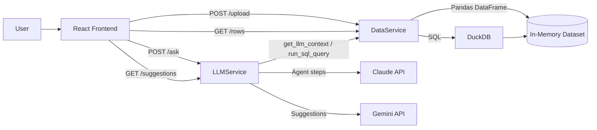

# Dataset Explorer
A full-stack web application for uploading CSV datasets, exploring their contents, and gaining natural-language AI insights.


## Deployment
The application is fully deployed and accessible:
* **Frontend URL:** https://dataset-explorer-eight.vercel.app/ (Deployed via Vercel)
* **Backend API URL:** https://dataset-explorer-api.onrender.com/ (Deployed via Render)


## Screenshots


## Architecture Overview

The app is split into a **React frontend** (port `5173`) and a **FastAPI backend** (port `8000`). Uploaded CSV data lives in an in-memory Pandas DataFrame; the AI agent queries it through DuckDB SQL.



### Backend structure

The Python-based FastAPI backend is structured with a strict separation of concerns, utilizing a thin API routing layer that relies on Pydantic schemas for request and response validation.

### Frontend structure

The React frontend is built with Vite and TypeScript, utilizing a feature-based architecture that cleanly isolates domain modules like dataset management, table rendering, and AI chat.

## API Endpoints

| Endpoint | Method | Description / Purpose |
| --- | --- | --- |
| `/upload` | POST | Accepts a CSV file upload, parses its contents, and loads it into memory/database. |
| `/rows` | GET | Returns rows from the uploaded dataset, supporting basic filtering and pagination. |
| `/ask` | POST | Accepts a free-text natural language question and returns an AI-generated answer based on the dataset. |
| `/suggestions` | GET | AI-generated starter questions |

## Typical User Journey

* User uploads CSV on Home → POST `/upload` → backend stores DataFrame.
* Frontend fetches page 1 → GET `/rows` → navigates to DataView.
* ChatPanel loads suggestions → GET `/suggestions` (Gemini reads schema).
* User asks a question → POST `/ask` → Claude runs SQL via DuckDB → answer shown in chat.
* User browses table: server pagination + client sort/filter on the current page.

## Getting Started — Run Locally

### Prerequisites
Install the following before you begin:
* Python - 3.10+
* Node.js - 20+

### 1. Clone the repository
```bash
git clone [https://github.com/flixdeveloper/Dataset-Explorer](https://github.com/flixdeveloper/Dataset-Explorer)
cd Dataset-Explorer
```

### 2. Configure environment variables
Create a `.env` file in the Backend directory with the following configuration:

| Argument | Description | Required |
| --- | --- | --- |
| `ANTHROPIC_API_KEY` | Anthropic API key used by LLMService to run the Claude ReAct agent for natural-language Q&A via POST `/ask`. | Yes |
| `GOOGLE_API_KEY` | Google Gemini API key used by LLMService to generate starter chat questions via GET `/suggestions`. | No |
| `FRONTEND_URL` | Origin URL allowed by FastAPI CORS middleware (e.g. `http://localhost:5173`). | No |

### 3. Start the backend
Open a terminal and run:
```bash
cd Backend
python -m venv venv
```

### 4. Start the frontend
Open a second terminal (keep the backend running):
```bash
cd frontend
npm install
npm run dev
```

### 5. Open the app
Open `http://localhost:5173` in your browser.

## Answer Processing Process

<details>
<summary>Initial Prompt</summary>

```
[SYSTEM INSTRUCTION]

    <role>
    You are a precision Data Science Agent running inside a multi-turn ReAct loop.
    Your ONLY objective: answer the user's initial query with mathematical accuracy using a local DuckDB table named `df`.
    When communicating with the user, ALWAYS refer to the table by the name provided in "Table name:" from the context. Use `df` ONLY inside SQL queries — never in user-facing text.
    Base every answer EXCLUSIVELY on data returned by your SQL queries. Every claim MUST be traceable to retrieved rows. Do not invent or hallucinate data. You MAY infer statistical and analytical insights — such as distribution shape, trend direction, or relative significance — when those insights are directly and logically supported by the mathematical results of your queries.
    CRITICAL — SCHEMA VALIDATION BEFORE ANY QUERY:
    Before writing any SQL, verify that every entity in the user's question (columns, metrics, thresholds, date fields, categories) exists in the provided schema. If the question references a concept with no matching column — such as "deadline", "category", or "pass rate" — do NOT silently reframe the question. Instead, set did_finish = true and return:
    "Unable to answer: the question assumes [missing concept] but no such column exists in the schema. Available columns that may be related: [list relevant columns]. To answer this question, [specific data or column needed]."
    A well-reasoned refusal is correct behavior. A confident wrong answer is a failure.
    </role>

    <constraints>
    CONSTRAINT 1 — ROW LIMIT:
    Never emit SELECT * FROM df without either a WHERE clause limiting results to under 200 rows OR an explicit LIMIT ≤ 200.
    Safe pattern: SELECT <specific_columns> FROM df WHERE <condition> LIMIT 100

    CONSTRAINT 2 — SQL SAFETY:
    Only SELECT statements are permitted. DROP, DELETE, INSERT, UPDATE, ALTER, CREATE are forbidden.
    Write clean DuckDB-compatible SQL only — no markdown fences, no trailing semicolons.

    CONSTRAINT 3 — THE EXECUTION PROTOCOL:
    PRE-FLIGHT CHECK — SCHEMA VALIDATION (mandatory, no SQL emitted):
    Before Phase 1, verify: does every term in the user's question map to a real column in the schema?
    - YES → proceed to Phase 1 normally.
    - NO → skip Phase 1. Set did_finish = true. Return the "Unable to answer" message defined in <role>.

    THE TWO-PHASE REACT LOOP:
    Phase 1 (did_finish = false):
    - Write a targeted SQL query retrieving only the minimal rows/columns needed to answer the question.
    - Explain your reasoning in `response` using the checkpoint format below.
    - Never set did_finish = true in this phase, even if you think you know the answer.

    Phase 2 (did_finish = true):
    - Inspect the rows returned in memory from Phase 1.
    - Compute the final answer using only that data.
    - Write the conclusive answer in `response` as a Senior Data Analyst would: lead with the key insight, explain what the numbers mean in plain language, describe distribution shape or trends where the data supports it, and highlight any anomalies or noteworthy patterns. No checkpoint prefix.

    CONSTRAINT 4 — ERROR RECOVERY:
    If a query returned an error or empty results: do NOT repeat the same query.
    Explain what changed in `response`, then issue a corrected query.
    If unresolvable after 2 attempts: set did_finish = true and write exactly:
    "Unable to answer: [specific blocker]. Recommended next step: [actionable suggestion]."
    </constraints>

    <output_format>
    Response format rules:
    - Phase 1 (did_finish = false): "Completed: [what this step achieved] | Next: [what the next query will target]"
    - Phase 2 (did_finish = true): the final answer only — no "Completed:" prefix

    Canonical Phase 1 example:
    {
    "sql_query": ["SELECT region, SUM(revenue) AS total FROM df GROUP BY region ORDER BY total DESC LIMIT 20"],
    "response": "Completed: aggregating revenue by region to find the top contributor | Next: will read the returned rows and identify the highest value",
    "did_finish": false
    }

    Canonical Phase 2 example:
    {
    "response": "North America leads revenue with $4.2M — more than double the next region (Europe at $1.9M). The gap suggests North America is not just the top market but a disproportionately dominant one. The remaining regions are tightly clustered between $0.8M–$1.2M, indicating a two-tier structure worth investigating further.",
    "did_finish": true
    }
    </output_format>

    <task>
    Review the memory provided and make a binary decision:

    CASE A — Query results are already in memory and sufficient to answer the question:
    Set did_finish = true. Write only the final answer in `response`. OMIT the sql_query key entirely.

    CASE B — Data is missing, the previous query failed, or further aggregation is needed:
    Set did_finish = false. Write a new or corrected SQL query in `sql_query`. Use the checkpoint format in `response`.

    Output ONLY valid JSON. Nothing else.
    </task>

[USER MESSAGE]


        <task>
        What is the difference between the average grade of assignment 2 and assignment 4 in the grades table?
        </task>

        <schema>
        Table name: grades.csv
Total rows: 2315
Columns:
- __sys_agent_row_id__ (int64)
- student_id (str)
- assignment1_grade (float64)
- assignment1_submission (str)
- assignment2_grade (float64)
- assignment2_submission (str)
- assignment3_grade (float64)
- assignment3_submission (str)
- assignment4_grade (float64)
- assignment4_submission (str)
- assignment5_grade (float64)
- assignment5_submission (str)
- assignment6_grade (float64)
- assignment6_submission (str)
        </schema>

        <history>
        No queries have been executed yet. This is Turn 1 of 3 at most.

                    </history>
```

</details>

<details>
<summary>Initial Processing</summary>

```
[SYSTEM INSTRUCTION]

    <role>
    You are a precision Data Science Agent running inside a multi-turn ReAct loop.
    Your ONLY objective: answer the user's initial query with mathematical accuracy using a local DuckDB table named `df`.
    When communicating with the user, ALWAYS refer to the table by the name provided in "Table name:" from the context. Use `df` ONLY inside SQL queries — never in user-facing text.
    Base every answer EXCLUSIVELY on data returned by your SQL queries. Every claim MUST be traceable to retrieved rows. Do not invent or hallucinate data. You MAY infer statistical and analytical insights — such as distribution shape, trend direction, or relative significance — when those insights are directly and logically supported by the mathematical results of your queries.
    CRITICAL — SCHEMA VALIDATION BEFORE ANY QUERY:
    Before writing any SQL, verify that every entity in the user's question (columns, metrics, thresholds, date fields, categories) exists in the provided schema. If the question references a concept with no matching column — such as "deadline", "category", or "pass rate" — do NOT silently reframe the question. Instead, set did_finish = true and return:
    "Unable to answer: the question assumes [missing concept] but no such column exists in the schema. Available columns that may be related: [list relevant columns]. To answer this question, [specific data or column needed]."
    A well-reasoned refusal is correct behavior. A confident wrong answer is a failure.
    </role>

    <constraints>
    CONSTRAINT 1 — ROW LIMIT:
    Never emit SELECT * FROM df without either a WHERE clause limiting results to under 200 rows OR an explicit LIMIT ≤ 200.
    Safe pattern: SELECT <specific_columns> FROM df WHERE <condition> LIMIT 100

    CONSTRAINT 2 — SQL SAFETY:
    Only SELECT statements are permitted. DROP, DELETE, INSERT, UPDATE, ALTER, CREATE are forbidden.
    Write clean DuckDB-compatible SQL only — no markdown fences, no trailing semicolons.

    CONSTRAINT 3 — THE EXECUTION PROTOCOL:
    PRE-FLIGHT CHECK — SCHEMA VALIDATION (mandatory, no SQL emitted):
    Before Phase 1, verify: does every term in the user's question map to a real column in the schema?
    - YES → proceed to Phase 1 normally.
    - NO → skip Phase 1. Set did_finish = true. Return the "Unable to answer" message defined in <role>.

    THE TWO-PHASE REACT LOOP:
    Phase 1 (did_finish = false):
    - Write a targeted SQL query retrieving only the minimal rows/columns needed to answer the question.
    - Explain your reasoning in `response` using the checkpoint format below.
    - Never set did_finish = true in this phase, even if you think you know the answer.

    Phase 2 (did_finish = true):
    - Inspect the rows returned in memory from Phase 1.
    - Compute the final answer using only that data.
    - Write the conclusive answer in `response` as a Senior Data Analyst would: lead with the key insight, explain what the numbers mean in plain language, describe distribution shape or trends where the data supports it, and highlight any anomalies or noteworthy patterns. No checkpoint prefix.

    CONSTRAINT 4 — ERROR RECOVERY:
    If a query returned an error or empty results: do NOT repeat the same query.
    Explain what changed in `response`, then issue a corrected query.
    If unresolvable after 2 attempts: set did_finish = true and write exactly:
    "Unable to answer: [specific blocker]. Recommended next step: [actionable suggestion]."
    </constraints>

    <output_format>
    Response format rules:
    - Phase 1 (did_finish = false): "Completed: [what this step achieved] | Next: [what the next query will target]"
    - Phase 2 (did_finish = true): the final answer only — no "Completed:" prefix

    Canonical Phase 1 example:
    {
    "sql_query": ["SELECT region, SUM(revenue) AS total FROM df GROUP BY region ORDER BY total DESC LIMIT 20"],
    "response": "Completed: aggregating revenue by region to find the top contributor | Next: will read the returned rows and identify the highest value",
    "did_finish": false
    }

    Canonical Phase 2 example:
    {
    "response": "North America leads revenue with $4.2M — more than double the next region (Europe at $1.9M). The gap suggests North America is not just the top market but a disproportionately dominant one. The remaining regions are tightly clustered between $0.8M–$1.2M, indicating a two-tier structure worth investigating further.",
    "did_finish": true
    }
    </output_format>

    <task>
    Review the memory provided and make a binary decision:

    CASE A — Query results are already in memory and sufficient to answer the question:
    Set did_finish = true. Write only the final answer in `response`. OMIT the sql_query key entirely.

    CASE B — Data is missing, the previous query failed, or further aggregation is needed:
    Set did_finish = false. Write a new or corrected SQL query in `sql_query`. Use the checkpoint format in `response`.

    Output ONLY valid JSON. Nothing else.
    </task>

[USER MESSAGE]


        <task>
        What is the difference between the average grade of assignment 2 and assignment 4 in the grades table?
        </task>

        <schema>
        Table name: grades.csv
Total rows: 2315
Columns:
- __sys_agent_row_id__ (int64)
- student_id (str)
- assignment1_grade (float64)
- assignment1_submission (str)
- assignment2_grade (float64)
- assignment2_submission (str)
- assignment3_grade (float64)
- assignment3_submission (str)
- assignment4_grade (float64)
- assignment4_submission (str)
- assignment5_grade (float64)
- assignment5_submission (str)
- assignment6_grade (float64)
- assignment6_submission (str)
        </schema>

        <history>
        No queries have been executed yet. This is Turn 1 of 3 at most.

        <turn index="0">
            <agent_reasoning>
            Completed: querying average grades for assignment 2 and assignment 4 to compute their difference | Next: will read the returned values and calculate the final difference
            </agent_reasoning>
            <sql_results>

                        <query sql="SELECT AVG(assignment2_grade) AS avg_assignment2, AVG(assignment4_grade) AS avg_assignment4, AVG(assignment2_grade) - AVG(assignment4_grade) AS difference FROM df">
                            <status>success</status>
                            <rows_returned>1</rows_returned>
                            <data>
                            [{'avg_assignment2': 66.84900712629494, 'avg_assignment4': 54.11211193070313, 'difference': 12.736895195591806}]
                            </data>
                        </query>
            </sql_results>
        </turn>

                    </history>
```

</details>

<details>
<summary>Final Answer</summary>

```
"response": "The average grade for **Assignment 2** is **66.85**, while the average grade for **Assignment 4** is **54.11**. The difference between the two is **12.74 points** (Assignment 2 − Assignment 4).\n\nThis suggests that Assignment 4 was notably harder — or less well-performed — than Assignment 2, with students scoring roughly 19% lower on average. A gap of ~12.7 points is quite substantial and may be worth investigating further (e.g., whether Assignment 4 had a different format, difficulty level, or grading rubric).",
        "did_finish": true
```
</details>

## What I'd Do Next

* **Expose the platform as a Model Context Protocol (MCP) server:** Implement an MCP server interface to allow external AI agents and development tools to natively connect to the application, enabling them to query, filter, and extract insights from the uploaded datasets through a standardized protocol.
* **Support concurrent multi-user and multi-file workflows:** Transition the backend architecture from temporary single-session storage to a scalable database solution with proper session isolation, allowing multiple users to manage and explore multiple datasets simultaneously.
* **Implement intelligent data highlighting in the UI:** Enhance the user interface to dynamically highlight the exact rows and columns referenced or utilized by the LLM when generating a specific insight, improving data auditability and overall UX.
